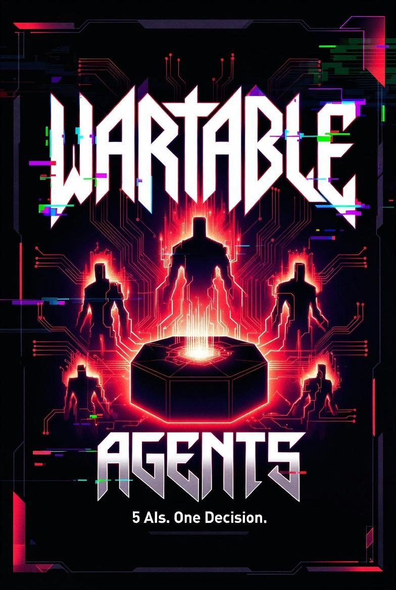

# War Table

**5 AIs. One Decision.**

A beautiful, self-contained demo where Claude, GPT-5, Gemini, Qwen, and Grok debate your toughest questions in three structured rounds — and deliver a single, thoughtful verdict.

**Live demo:** [wartable.qzz.io](https://wartable.qzz.io) (or [GitHub Pages fallback](https://nostalgicgarethdev.github.io/war-table/))



## Custom Domain Setup (wartable.qzz.io)

Your site is ready for the custom domain `wartable.qzz.io`.

### Quick explanations
- **Name Server (NS):** The "brain" that manages your domain's DNS records. For qzz.io subdomains it's handled in the DigitalPlat dashboard (or Cloudflare if you set custom nameservers). You rarely change this.
- **CNAME:** A DNS "alias" record. It makes `wartable.qzz.io` point to GitHub Pages (`nostalgicgarethdev.github.io`).

### DNS Configuration
Log into your domain provider (DigitalPlat for qzz.io, or wherever you manage DNS / Porkbun / Cloudflare):

1. Go to DNS records for the `wartable` part.
2. Add a **CNAME** record:
   - **Name / Host**: `wartable` (or the subdomain label)
   - **Target / Value**: `nostalgicgarethdev.github.io`
   - TTL: 300 (5 minutes) or default
3. Save and wait for propagation (usually 5-60 minutes).

If using Porkbun:
- Use the "Github" quick config button if available, or manually add the CNAME as above.

### GitHub Pages Configuration
1. Go to your repo → **Settings → Pages**
2. Under **Custom domain**, enter: `wartable.qzz.io`
3. Click Save.
4. Once the check passes, enable **Enforce HTTPS**.

The `site/CNAME` file already contains `wartable.qzz.io` and gets deployed automatically.

### Note on Porkbun
If you're setting up a new domain on Porkbun instead:
- Add the CNAME as described.
- Then tell me the exact domain name and I'll update all files here.

### Troubleshooting
- DNS check in GitHub failing? Make sure the CNAME record is correct and the `site/CNAME` file matches.
- Still seeing GitHub Pages URL? Propagation takes time. Use `dig wartable.qzz.io` or a DNS checker to verify.

## ✨ Features

- **Fully standalone** — No backend or API keys required. Everything runs beautifully in the browser.
- **Rich simulation** — Each model has a distinct personality and argues across Opening Statements → Rebuttals → Synthesis.
- **Interactive & configurable** — Choose number of rounds and which models participate.
- **Stunning UI** — Professional dark cyber theme with the official WARTABLE AGENTS poster as a dramatic full-screen background, glassmorphic panels, and smooth animations.
- **Deployed via GitHub Actions** — Clean static site on GitHub Pages.

## 🚀 Quick Start

```bash
git clone https://github.com/nostalgicgarethdev/war-table.git
cd war-table/frontend
npm install
npm run dev
```

Open http://localhost:5173 — enter any question and watch the agents debate.

## 🛠️ Project Structure (Frontend-focused)

```
war-table/
├── frontend/              # The beautiful React demo (the star of the show)
│   ├── src/
│   │   ├── App.tsx        # Main app + debate simulator
│   │   ├── App.css        # Professional dark + glassmorphic styles
│   │   └── assets/        # WARTABLE AGENTS background
│   ├── public/
│   └── vite.config.ts
├── backend/               # (Optional) Future real model integrations
├── .github/workflows/deploy.yml  # Official GitHub Pages deployment
└── README.md
```

## 📦 Deployment

The site is automatically deployed to GitHub Pages using the official Actions workflow.

1. Push to `main`.
2. GitHub Actions builds the frontend and deploys the `dist` folder.
3. Settings → Pages must be set to **GitHub Actions**.

The WARTABLE AGENTS background image is included and will display beautifully.

## 🧹 Repo Cleanup

- Proper `.gitignore` (no node_modules, builds, or dist committed)
- Legacy static demos cleaned up
- Frontend is now the primary, polished experience
- Image assets properly managed via Vite

## 🎨 Design Notes

- Dark professional theme with cyber accents
- The official poster serves as a fixed, dramatic background
- Glassmorphic surfaces for depth and elegance
- Fully responsive and accessible

---

Made with ❤️ for great AI debates. The frontend looks really nice. 

(Backend exists for future real API calls if you want to extend it.)
```env
PORT=3001
NODE_ENV=development

# Optional: API keys for real AI model access
# ANTHROPIC_API_KEY=your_key_here
# OPENAI_API_KEY=your_key_here
# GOOGLE_API_KEY=your_key_here
# XAI_API_KEY=your_key_here
# QWEN_API_KEY=your_key_here
```

> **Note**: The system works perfectly in mock mode without API keys for testing and development!

### Running Locally
```bash
# Start backend development server
cd backend
npm run dev
# Server runs on http://localhost:3001

# In a new terminal, start frontend development server  
cd frontend
npm run dev
# Application runs on http://localhost:5173
```

### Building for Production
```bash
# Build frontend
cd frontend
npm run build
# Output in ./dist directory

# Build backend
cd backend
npm run build
# Output in ./build directory
```

## 🧪 Testing

```bash
# Run backend tests (if implemented)
cd backend
npm test

# Run frontend tests (if implemented)  
cd frontend
npm test

# Linting
npm run lint  # Runs both frontend and backend linting
```

## 🚀 Deployment

### Frontend (GitHub Pages) — Recommended
The beautiful, fully self-contained React frontend is automatically built and deployed using the official GitHub Pages action:

- Push to `main` (or manual dispatch) → GitHub Actions builds the React app and deploys the `dist/` folder
- Live site: https://wartable.qzz.io/ (GitHub fallback: https://nostalgicgarethdev.github.io/war-table/)
- 100% static — works instantly with rich simulated debates (no backend required)
- Workflow: `.github/workflows/deploy.yml`

**Important:** In your repo, go to **Settings → Pages → Build and deployment → Source** and select **GitHub Actions** (not "Deploy from a branch").

To deploy locally for testing:
```bash
cd frontend
npm run build
# Open the dist/ folder or use any static host (Netlify, Vercel, Pages, Surge, etc.)
```

### Full Stack (Local Development)
```bash
# Terminal 1
cd backend && npm run dev

# Terminal 2
cd frontend && npm run dev
```

### Backend (Optional Production Hosting)
If you want real AI model calls, deploy the backend separately (Render, Railway, Fly.io, etc.) and update the frontend to point at it.

### Legacy
Old pure-HTML demos live in `static-site/` and `simple-site/` (mostly historical).

## 📖 API Reference

### Start a Debate
```
POST /api/debate/start
Body: { "question": "string", "config": { "rounds": number, "models": string[] } }
Response: { "sessionId": "string", "message": "string" }
```

### Get Debate Details
```
GET /api/debate/:sessionId
Response: Full debate session object
```

### Get All Debates
```
GET /api/debate/
Response: Array of debate session summaries
```

### Get Debate Results/Verdict
```
GET /api/debate/:sessionId/results
Response: { sessionId, question, verdict, rounds, completedAt }
```
Returns 400 if debate not completed.

## 🤖 AI Model Personalities

Each model has a distinct response style in mock mode:

- **Claude**: Careful, evidence-based reasoning with balanced analysis
- **GPT-5**: Comprehensive, structured, multi-faceted perspectives  
- **Gemini**: Analytical, detail-oriented with strong logical flow
- **Qwen**: Efficient, practical, solution-focused approach
- **Grok**: Direct, unconventional thinking with bold perspectives

## ⚙️ Configuration

Debate settings can be customized when starting a session:
- `rounds`: Number of debate rounds (default: 3)
- `models`: Array of model IDs to include (default: all 5)
- Future enhancements: temperature, maxTokens, custom prompts

## 🔬 How It Works

1. **Question Submission**: User enters a question through the frontend
2. **Session Creation**: Backend creates unique debate session with ID
3. **Round Processing**: 
   - Orchestrator sends prompts to each model per round
   - Context from previous rounds is preserved and included
   - Models generate responses based on their personalities
4. **Consensus Generation**: After final round, consensus engine analyzes responses
5. **Result Delivery**: Complete debate transcript and verdict returned to user
6. **Visualization**: Frontend displays real-time progress and final results

## 📚 Extending the System

### Adding a New Debate Round
1. Create round handler in `backend/src/debate/rounds/` (e.g., `crossExamination.ts`)
2. Implement round-specific prompting and response logic
3. Register the round type in `backend/src/debate/orchestrator.ts`
4. Update debate flow configuration
5. Add corresponding UI components if needed
6. Write unit tests

### Integrating a New AI Model
1. Add API client wrapper in `backend/src/models/` following base interface
2. Configure model-specific parameters (token limits, preferences)
3. Add model to registry in `backend/src/models/provider.ts`
4. Implement response normalization if needed
5. Update model configurations and rate limits
6. Test with sample prompts
7. Document characteristics

### Modifying Consensus Algorithm
1. Locate consensus logic in `backend/src/consensus/`
2. Implement new algorithm (weighted scoring, iterative refinement, etc.)
3. Create comprehensive test cases
4. Benchmark with sample debates
5. Update documentation
6. Consider A/B testing framework

## 📄 License

This project is licensed under the MIT License - see the LICENSE file for details.

## 🙏 Acknowledgments

- Inspired by multi-agent AI systems and debate methodologies
- Built with modern web technologies: React, Vite, Node.js, TypeScript
- Thanks to the open-source AI community for advancing LLM capabilities

---
*Created with ❤️ by Gareth Lee. Let the AI models debate your toughest questions!*

## 🐳 Node.js Compatibility

This project is compatible with Node.js 18+. The GitHub Actions workflow uses Node.js 18 to avoid deprecation warnings. If you need to use Node.js 20 locally, ensure you have the appropriate version installed.

